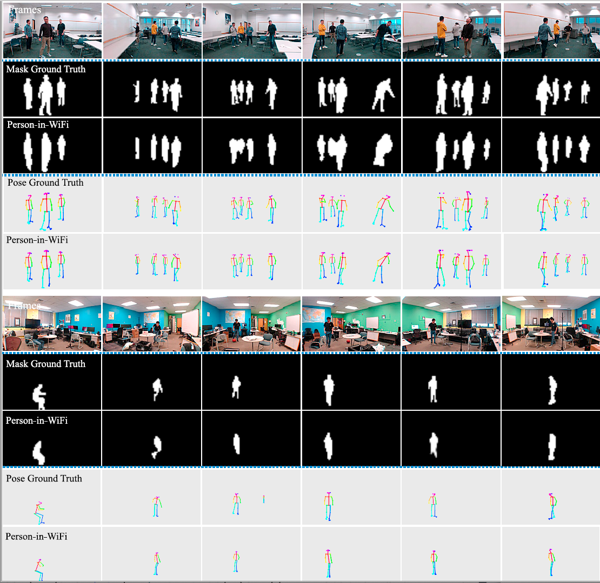

# WiFi Person
Code of paper, Person-in-WiFi: A Step towards Person Perception using 1D Sensors. In this paper, we tend to use WiFi to capture human pose and body.

# System
We use camera to capture human as annotations. Specifically, we use a Mask R-CNN implementation, [detectorch](https://github.com/ignacio-rocco/detectorch) to prepare human mask, and [OpenPose](https://github.com/CMU-Perceptual-Computing-Lab/openpose) python-api to prepare human pose with help of OpenPose developers, [Gines](https://github.com/gineshidalgo99) and [Nico](https://github.com/gnastacast).  

Meanwhile, we record WiFi signals to train a deep learning.

# Result

