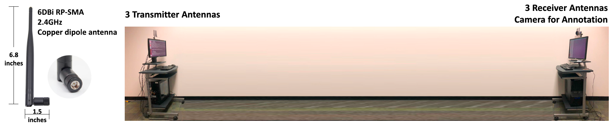

# WiFi Perception
Code of paper, Person-in-WiFi: Fine-grained Person Perception using WiFi. In this paper, we tend to use WiFi to capture human pose and body. The paper is under review, due to IRB issues, we have not made code publicly. Still, we release data collection tools in this repo.

# System
We use camera to capture human as annotations. Specifically, we use a Mask R-CNN implementation, [detectorch](https://github.com/ignacio-rocco/detectorch) to prepare human mask, and [OpenPose](https://github.com/CMU-Perceptual-Computing-Lab/openpose) python-api to prepare human pose with help of OpenPose developers, [Gines](https://github.com/gineshidalgo99) and [Raaj](https://github.com/soulslicer).  

Meanwhile, we record WiFi signals to train a deep learning.

# Result
